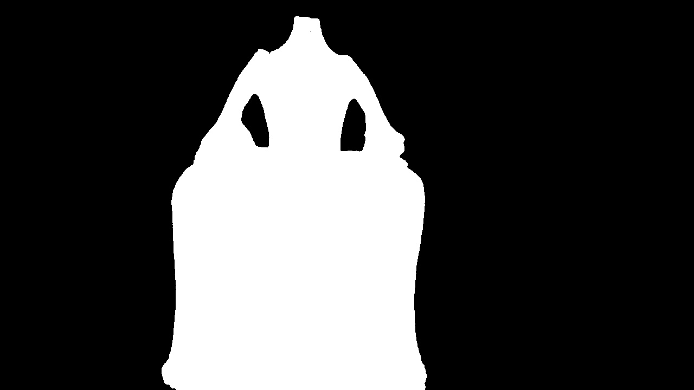

# SAMplify\_SuGaR

"SAMplify\_SuGaR" is a system that processes images to generate 3D meshes without backgrounds. By combining **SAM2** (Surface-Aligned Mesh) and **SUGAR** (Surface-Aligned Gaussian Splatting), it aligns surfaces and creates efficient 3D models, perfect for applications requiring clean, background-free reconstructions.
#### Pipeline:


<p align="center">
  
</p>

## Quick Start

To get started with this project, follow these simple steps:

### 1. Clone the repository

Run the following command to clone the repository to your local machine:

```bash
git clone --recurse-submodules https://gitlab.com/ilsp-xanthi-medialab/textailes/wp4/t4.5/samplify_sugar.git
# If you forgot --recurse-submodules:
git submodule update --init --recursive
```

### 2. Navigate to the project directory

After cloning, go to the project folder:

```bash
cd SAMplify_SuGaR
```


### 3. Prepare dataset

You need to prepare the dataset by creating a **data** folder inside the **SAM2-Docker** directory. Inside this **data** folder, you will store the images with a `.jpg` extension. The images should be placed in a subfolder named after your dataset.

Follow these steps:

1. Navigate to the **SAM2-Docker** directory:

   ```bash
   cd SAM2
   ```


2. Create a folder inside **data** to store your images. Name the folder after your dataset, for example:

   ```bash
   mkdir -p data/input/your_dataset_name
   ```

3. Place your `.jpg` images into the **your\_dataset\_name** folder.


Now, your **SAM2** directory should have the following structure:

```
SAM2/
└── data/
    └── input/
        └── <DATASET_NAME>/
            ├── image1.jpg
            ├── image2.jpg
            └── ...

```

These images will now be ready to be processed by the SAM2-Docker system.

---


### 4. Set environment variables for the paths
Before running the pipeline, you need to set up the environment variables for the paths of the **SAM2-Docker** and **SuGaR-Docker** repositories.

Set the paths for **sam_fit_sugar**  by adding this line to your terminal:

```bash
export SAMPLIFY_SUGAR_PATH="/path/to/SAMPLIFY_SUGAR_PAT"
```

Make sure to replace `"/path/to/SAMPLIFY_SUGAR_PAT"` with the correct path where the repositorie is located on your system.

### 5. Run the pipeline

Once the paths are set, you can run the pipeline with the following command:

```bash
cd ..
bash run_pipeline.sh your_dataset_name
```

This will execute the **SAM2** and **SuGaR** pipelines for the specified dataset.

---


# SAM2 + SuGaR Pipeline for 3D Reconstruction

## Overview

This project uses the SAM2 and SuGaR frameworks for 3D reconstruction of images, generating high-quality models with background removal. By clicking on significant points in an image, the SAM2 model generates a mask that isolates the object of interest.

## Workflow
## Mask Generation
### 1. Image Loading and Point Annotation

The process starts by loading an image. The user can click on the image to add points of interest:

- **Left-click** to add **positive points** (marked in **green**).
- **Right-click** to add **negative points** (marked in **red**).

The tool allows the user to select specific regions of the image, which will later be used to create a mask.

The tool allows the user to select specific regions of the image, which will later be used to create a mask.

<p align="center">
  
</p>

#### Example Image (before mask creation):
<p align="center">
  
</p>

### 2. Generating the Mask with SAM2

Once enough points are added, the SAM2 model generates a **mask** that isolates the object of interest. The mask is a binary image that shows the identified area.

#### Mask Output:
<p align="center">
  
</p>

### 3. Overlay of Mask on Image

After the mask is created, it is applied to the original image, showing the object against a transparent or black background, as shown below:

<p align="center">
  
</p>


### 4. Final Output

The final result is an image where the object is isolated from the background, ready for further processing or 3D reconstruction.

##  Structure-from-Motion with COLMAP

The masked images are passed to **COLMAP** to estimate **camera poses** and generate a **sparse/dense point cloud**.

<p align="center">
  
</p>

## Surface-Aligned Gaussian Splatting (SuGaR)

The COLMAP reconstruction initializes a SuGaR model, producing a **3D Gaussian field**.

<p align="center">
  
</p>

We can visualize both the **splat points** and the **ellipsoids** that represent their covariance:

<p align="center">
  
</p>

### Mesh Extraction and Texturing

Finally, the SuGaR output is converted to a **Poisson mesh** and textured.

**Textured Mesh Output:**

<p align="center">
  
</p>


## Steps to Use

1. **Clone the repository** and set up the environment.
2. **Load your images** into the appropriate directory.
3. **Run the pipeline** using the `run_pipeline.sh` script.
4. **Annotate the points** by clicking on the important areas of the image.
5. **Generate the mask**, which will be saved for further use.

For more details, check the documentation in the repository or the command line help.

λ